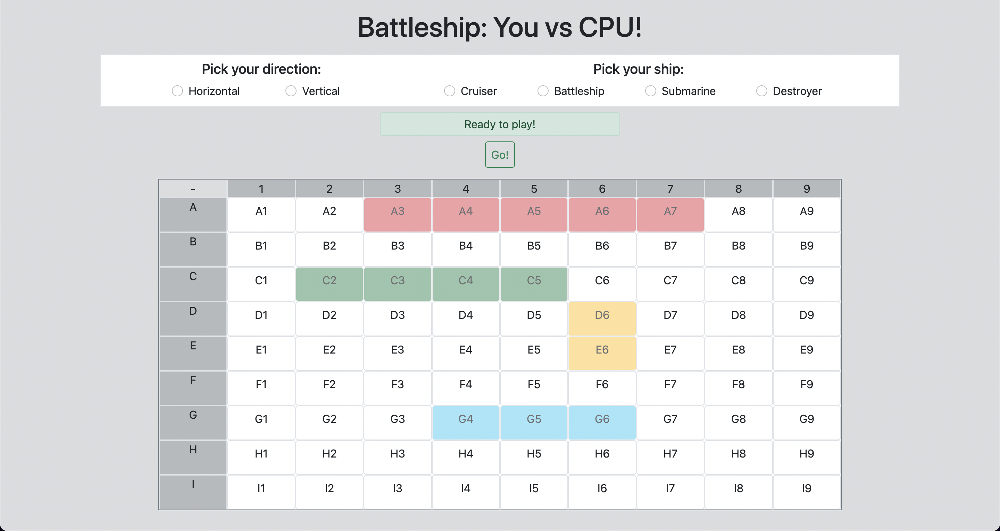
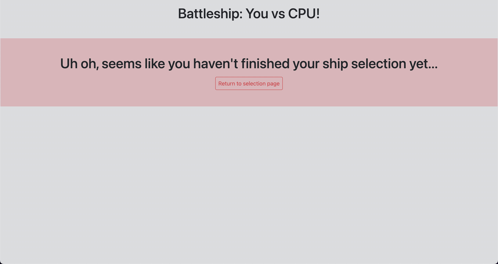
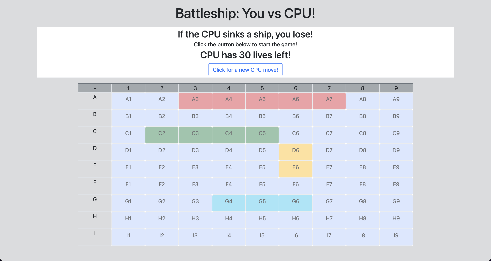
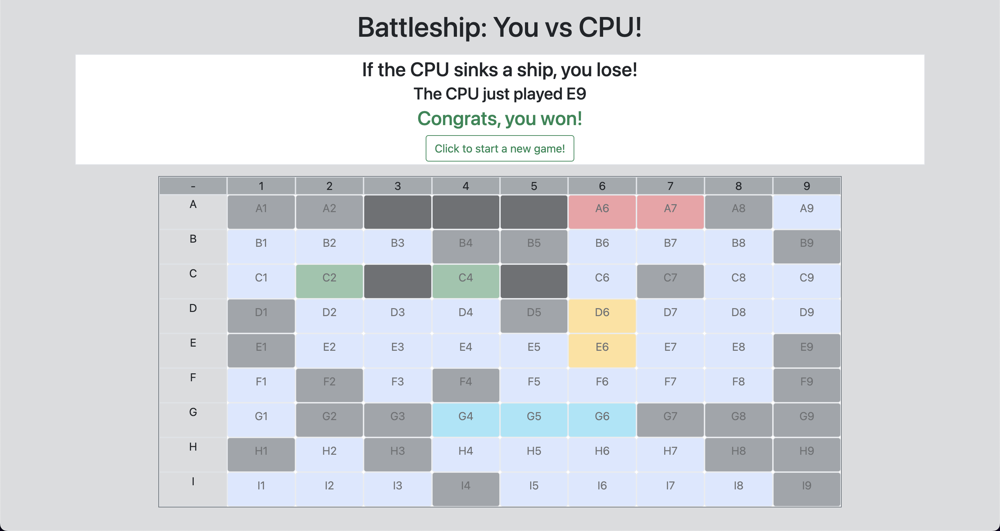

# Battleships created with React.JS

### Requirements:

- [Download Node.js if necessary](https://nodejs.dev/en/download/)
- Using `Node.js`, install `React` and `Webpack` on your computer. This code makes use of the `Flux` framework and the `React-Router-Dom` package

```
$ npm install -g create-react-app
$ npm install --global webpack
$ npm install flux
$ npm install react-router-dom
```

- Once everything is installed, create an `.env` file and run the script

```
$ npm install
$ cp .env.example .env
$ npm run start
```

### Technical info:

- All but three components were stylized using `Bootstrap`
- No `HTML5` was used outside the `React` files
- Heavy use of the `Flux` framework
- Minor use of `ContextAPI` and `react-router-dom`

### Gameplay

- Selection view : set your ships on the board
- Pick a direction (Horizontal or Vertical) and a ship (Cruiser, Battleship, Submarine, Destroyer)



- Once all ships are set, the Battle view will open
- If some ship is missing, you won't be able to play until you're finished



- Battle view : CPU has 30 lives to sink one of your ships
- Every time you press the button, the CPU will generate a random coordinate
- CPU will check if their attack was a hit or a miss, the results will be displayed on board



- If the CPU lives run out before any ship gets sunk, you win!



## Contributors

This project used the [React Webapp Boilerplate](https://github.com/4GeeksAcademy/react-hello-webapp) from 4Geeks Academy [Coding Bootcamp](https://4geeksacademy.com/us/coding-bootcamp), made by [Alejandro Sanchez](https://twitter.com/alesanchezr) and many other contributors, and served as part of a mock interview. Nonetheless, edits will be made over time.
